# Features

There are many features to cover, there fore only the most important are
listed below. Please note that with time the screens may differ from the
real implementation.

## Login scopes

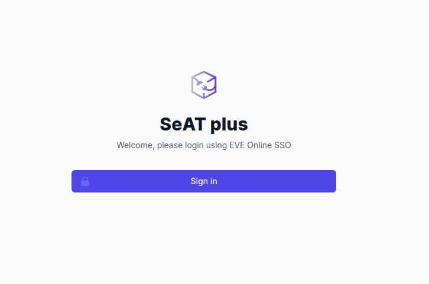

By default, seatplus only requests as single scope: `publicData`

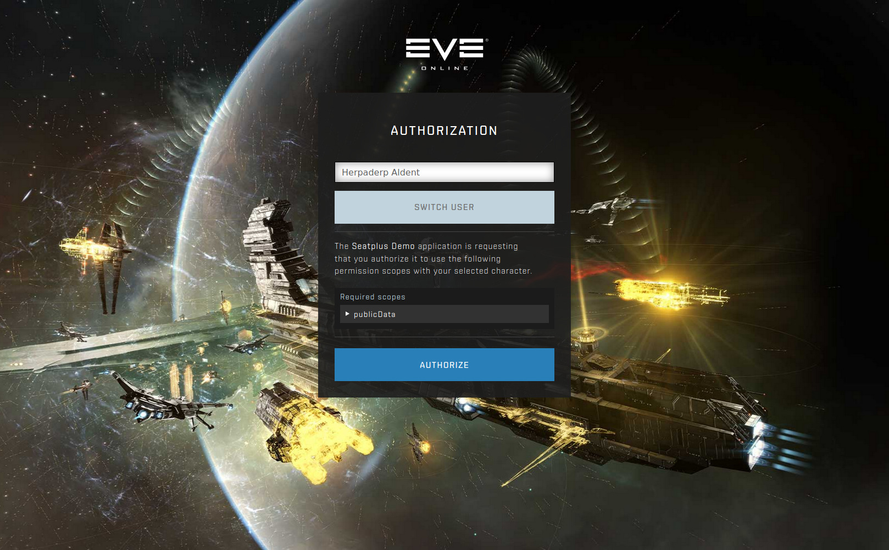

However, an admin may set up certain required scopes:
* Default (Character)
* User
* Global

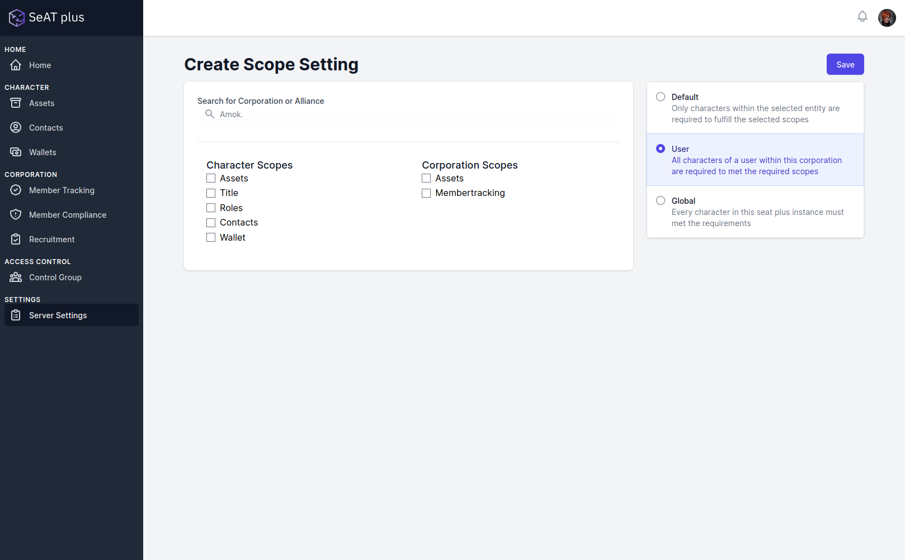

Following these rules, per selected corporation or alliance users are
being asked to supply a new refresh_token with the required scopes

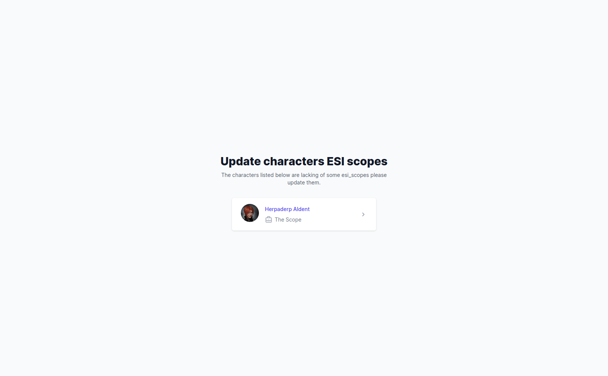

## Applications

User may apply to corporations after creating an enlistment. For the
enlistment one must chose if the enlistment should be valid for
character only or user.

| Type      | Description                                                                                                                                                                                                                            |
|:----------|:---------------------------------------------------------------------------------------------------------------------------------------------------------------------------------------------------------------------------------------|
| Character | User may apply with selected Characters to a corporation. Only the applicant must supply requested esi scopes. This might be useful if you are using seatplus as alliance tool where the same user may be part of various corporations |
| User      | User applies with every character to a corporation. Every character belonging to the user must supply the requested scopes.                                                                                                            |

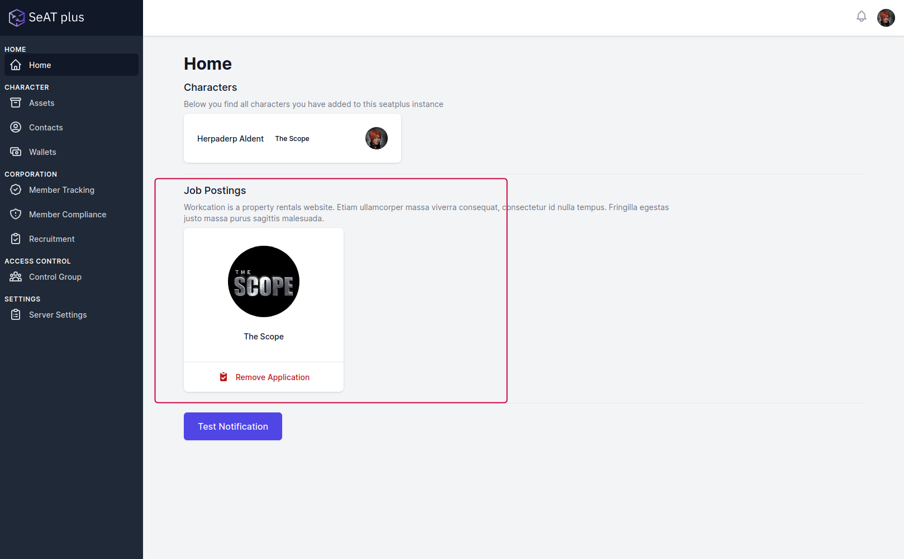

Recruiters may review the application in a specific view or by selecting
the character in the character specific categories:

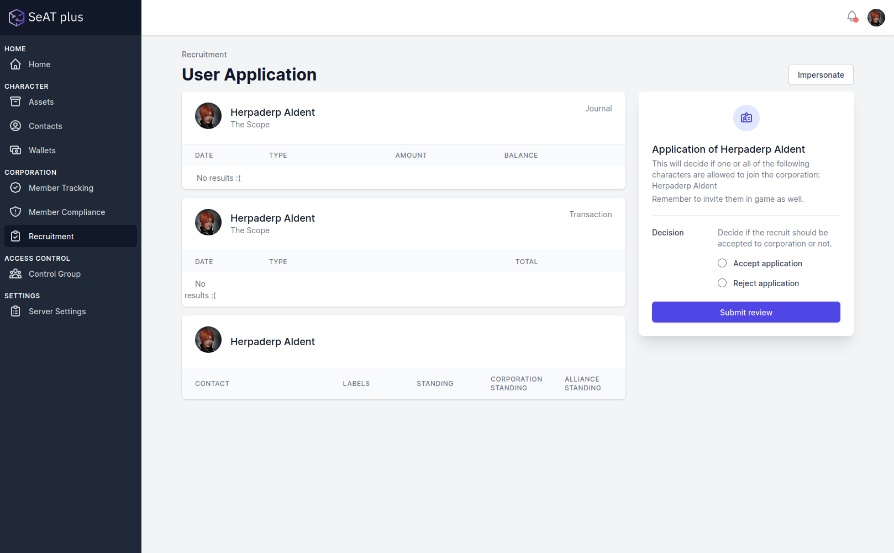

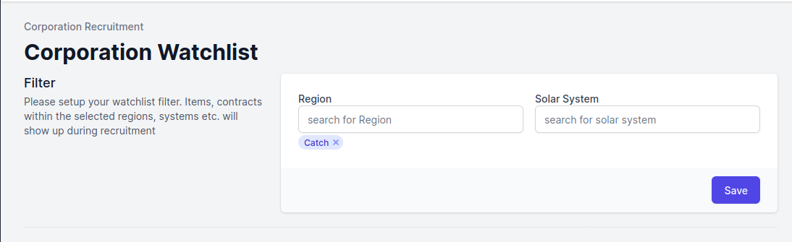

## Unknown Locations

There is a known limitation to ESI. One is not able to resolve
structures to which a character might not have access anymore.
Therefore, locations which are not resolvable can not be filtered by
region or system. Seatplus supports manual locations, which can be
accepted by a user with the necessairy permission:

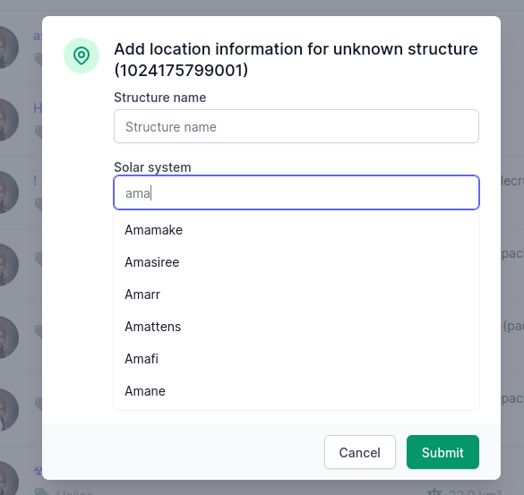

if to any point the location can resolved via esi, the manual location
will be removed.

## Asset Details

Ships, containers etc. can be reviewed with their slots
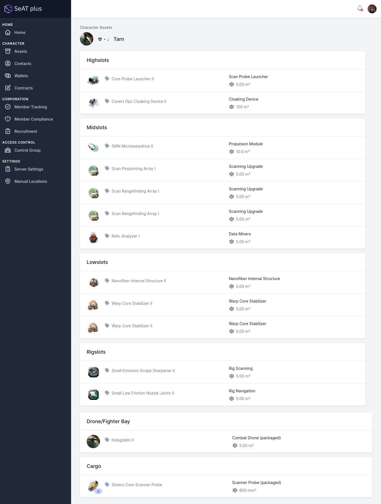

## Character Contacts
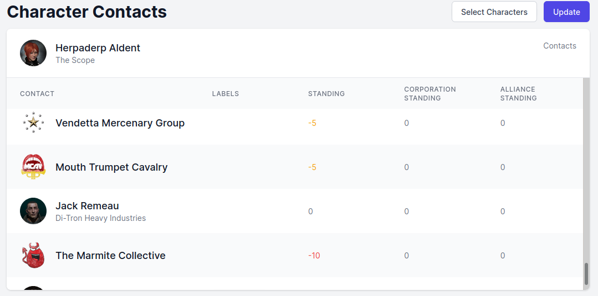

## Character Contracts
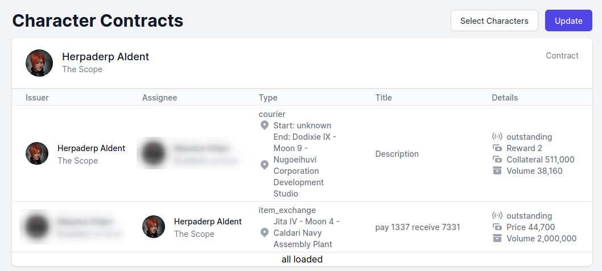

## Character Wallets

## Corporation Member Compliance
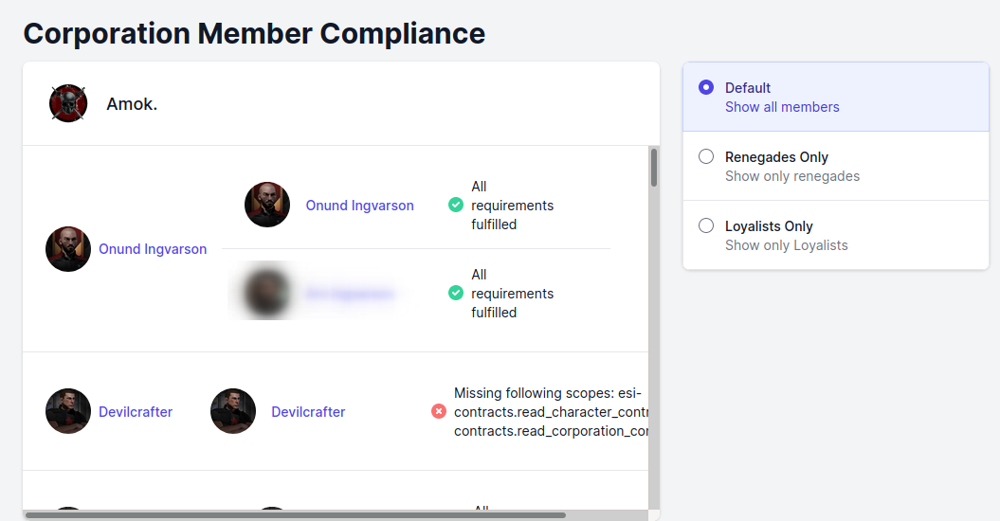

## Corporation Member Tracking
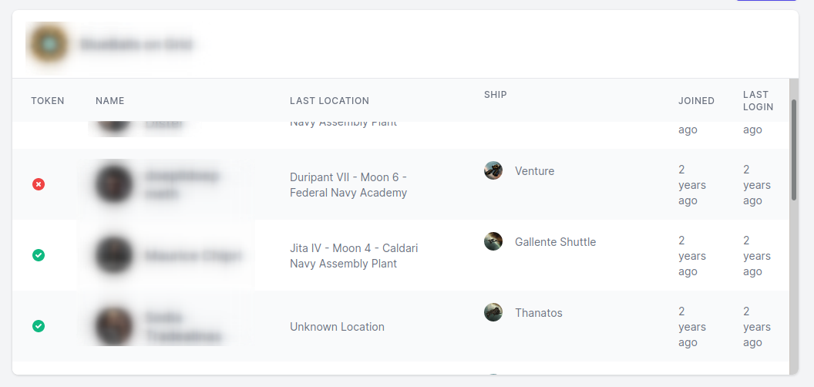